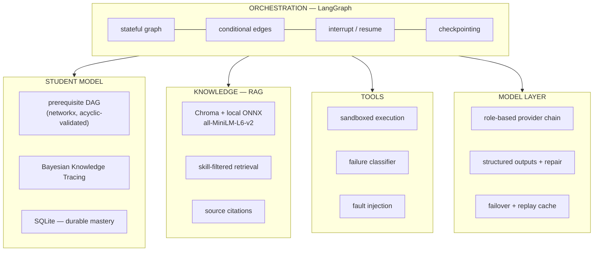
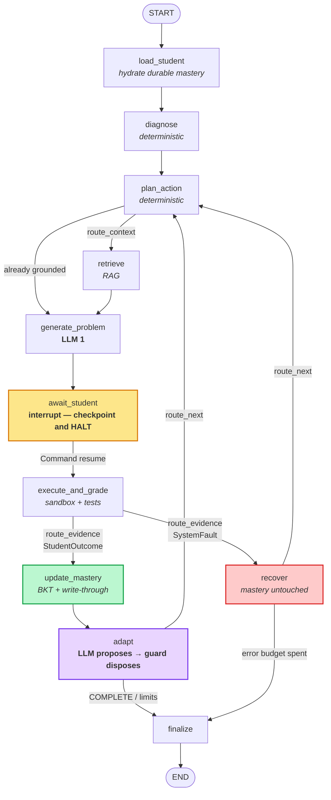
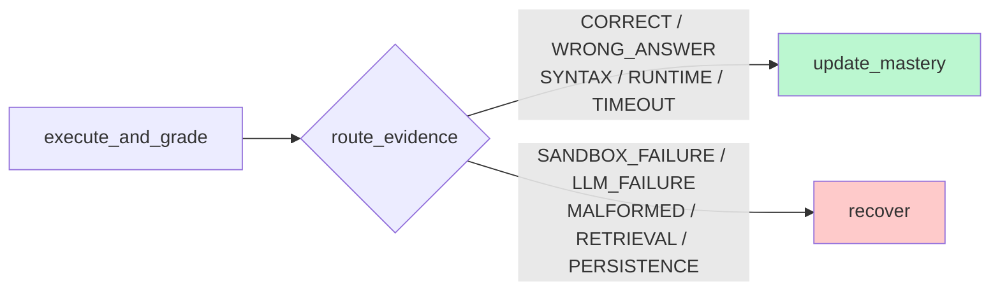
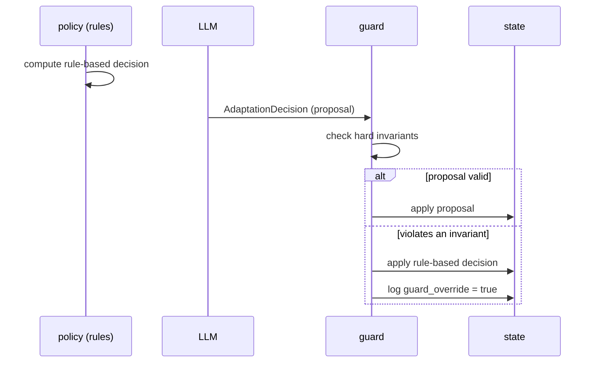

# CogniFlow — Architecture

**Team BloodCoded · Agentic AI Hackathon, Tech Zephyr 4.0, IIT Bhubaneswar**

---

## 1. The one-sentence version

An LLM proposes what to teach next; a deterministic guard decides whether it may, and a
Bayesian model of the student decides what the LLM gets to see.

---

## 2. Layers

Four layers, decoupled and independently testable. The orchestration layer knows only
interfaces, which is why the entire system can be exercised offline with a stub model,
an in-memory store, and a fault-injecting sandbox.

---

## 3. The graph

Eleven nodes. **Three of them call a model.** Everything else is arithmetic, and
arithmetic is already correct and free.

### Node inventory

| Node | Deterministic? | Responsibility |
|---|---|---|
| `load_student` | ✅ | Hydrate durable mastery into session state |
| `diagnose` | ✅ | Weak skills and prerequisite gaps, by graph traversal |
| `plan_action` | ✅ | Target skill, difficulty, assessment type, teaching mode |
| `retrieve` | ✅ tool | Skill-filtered semantic search with citations |
| `generate_problem` | ❌ **LLM** | Author a task grounded in retrieved material |
| `await_student` | ✅ | `interrupt()` — checkpoint and halt |
| `execute_and_grade` | ✅ tool | Run in sandbox, grade by test cases |
| `analyze_misconception` | **hybrid** | Names the misunderstanding; rules first, model only where judgement is needed |
| `update_mastery` | ✅ | BKT posterior + immediate write-through |
| `adapt` | **guarded** | Model proposes; deterministic guard validates |
| `recover` | ✅ | Absorb a `SystemFault` without touching mastery |
| `finalize` | ✅ | Close the session with an honest status |

> Code grading runs by execution rather than by asking a model whether the code looks
> right, which is stronger. The third model call site is misconception analysis.

---

## 4. The safety property, visible in the topology

`route_evidence` is the single edge that decides whether something is about to move a
mastery score:

`StudentOutcome` and `SystemFault` are **disjoint enums**. `update_mastery` accepts only
the former; passing the latter raises. So *"an infrastructure failure can never lower a
student's mastery"* is enforced by the type system and by graph topology, not by a
conditional a reviewer has to notice.

**The ambiguous case is resolved explicitly.** A timeout where the process *started* is
the student's own infinite loop and counts as real evidence. A process that *never
started* is our infrastructure. The `started` flag is the discriminator, and the mapping
is verified exhaustively across all twelve `status × started` combinations.

---

## 5. The architectural spine

> **The model proposes; the policy guard disposes.**

Invariants the guard enforces:

| Rule id | Constraint |
|---|---|
| `advance_requires_mastery` | `ADVANCE` needs mastery ≥ 0.6 **and** confidence ≥ 0.5 |
| `escalate_requires_mastery` | `ESCALATE_DIFFICULTY` needs mastery ≥ 0.8 **and** confidence ≥ 0.5 |
| `prereq_must_exist` | `REVISIT_PREREQUISITE` needs a real unmastered prerequisite |
| `prereq_depth_exceeded` | bounded remediation depth |
| `repeated_failure_needs_investigation` | cannot merely lower difficulty while a prerequisite gap exists |
| `loop_limit` | limits breached → only `COMPLETE` |
| `redirect_without_sufficient_evidence` | a detour needs evidence, or a misconception backing it |
| `premature_redirect_without_evidence` | a single failure is not grounds for abandoning a skill |

This buys three things at once: the model cannot corrupt a learning path, the override
rate is a measurable quantity, and **the demo's path holds even if the model says
something odd on stage**, because routing is deterministic.

---

## 5b. Misconception diagnosis - what makes the redirect causal

Repeated failure tells you *that* something is wrong. It does not tell you *what*.
`analyze_misconception` closes that gap, and it is deliberately a **hybrid**:

**Deterministic patterns run first.** A `RecursionError` means a missing or unreachable
base case - that is what the exception *means*, not a matter of opinion. Asking a model
to infer it would add latency, cost, and a different answer each run to a settled
question. The model is consulted only for failures the rules cannot name.

**A misconception implicates the skill actually at fault, which is often not the skill
being practised:**

| Signature | Misconception | Implicates |
|---|---|---|
| `TypeError: ... 'NoneType' and 'int'` | recursive call computed but not returned | **`functions`** |
| `RecursionError` | no reachable base case | `conditionals` |
| timeout with the process running | loop condition never false | `loops` |
| `NameError` | name never defined, or defined in another scope | `variables` |

That first row is the whole thesis in one line. A student failing recursion because
their recursive call returns `None` does not have a recursion problem - they have a
`return` problem, which is a functions problem wearing a recursion costume.

The diagnosis feeds prerequisite selection, so the redirect reason changes from
*"repeated failures indicate an unmastered prerequisite"* to
*"diagnosed misconception implicates 'functions'"*.

**The hint is evidence, not an override.** It can only promote a skill that is genuinely
an unmastered prerequisite, so a bad diagnosis can never send a student somewhere
arbitrary. Two guard rules police the boundary:
`premature_redirect_without_evidence` (a single failure justifies a detour only when a
misconception implicates that prerequisite) and `must_return_to_original_objective`.

Misconceptions persist on the skill node, surviving the session and informing future
problem generation.

---

## 6. Persistence - split by lifetime

| | Session state | Durable student state |
|---|---|---|
| Store | LangGraph `SqliteSaver` | SQLite `skill_mastery`, `attempt_log` |
| Keyed by | `thread_id` | `student_id` |
| Lifetime | one session | forever |
| Holds | current problem, retry counts, pending interrupt | mastery, confidence, attempts, misconceptions |
| On update | in-state | **write-through immediately** |

A session can be abandoned harmlessly. Learning cannot. Write-through is what makes a
crash mid-session survivable, and it is asserted by a test that reopens the store in a
fresh process.

---

## 7. Mastery — Bayesian Knowledge Tracing

Corbett & Anderson (1995). Four parameters per skill: prior knowledge `P(L0)`, learn
rate `P(T)`, slip `P(S)`, guess `P(G)`. Observe a response → Bayesian posterior → apply
the learning transition.

Chosen over `mastery += 0.1` because it is calibrated, models *slip* (knows it, answered
wrong) and *guess* (didn't know it, answered right) explicitly, and yields a
**confidence** signal from effective sample size that the adaptation policy consumes —
three attempts and thirty attempts at the same mastery are not equally trustworthy.

We also built a parameter-fitting pipeline and it produced an **honest negative result**
(§9 of the README): fitted parameters improved held-out log-likelihood but not AUC, and
since the system consumes mastery as a *threshold comparison* — which depends on ranking,
not calibration — literature defaults are retained.

---

## 8. Failure taxonomy

| `StudentOutcome` — updates mastery | `SystemFault` — never does |
|---|---|
| `CORRECT` | `SANDBOX_FAILURE` |
| `WRONG_ANSWER` | `LLM_FAILURE` |
| `STUDENT_SYNTAX_ERROR` | `MALFORMED_MODEL_OUTPUT` |
| `STUDENT_RUNTIME_ERROR` | `RETRIEVAL_FAILURE` |
| `STUDENT_TIMEOUT` | `PERSISTENCE_FAILURE` / `SYSTEM_ERROR` |

Recovery is chosen by **class**, never by string-matching an error message:

- **retryable** (rate limit, timeout, 5xx) → backoff and retry, then fail over
- **permanent** (bad key, unknown model) → abandon that provider immediately
- **malformed** (schema violation) → one repair turn feeding the validation errors back,
  then fall over
- chain exhausted → deterministic fallback, with the fault still recorded

---

## 9. What we deliberately did not build

The brief states multi-agent architectures, vector databases, RAG, and long-term memory
are **not mandatory**. Being able to justify an omission is engineering judgement:

- **No multi-agent orchestration.** One goal, one coherent state. Splitting it adds
  coordination failure modes and buys nothing here.
- **No fuzzy retrieval over rules.** Prerequisite relations and thresholds must be
  applied *exactly*; approximate matching there would be a correctness regression.
- **No fine-tuning.** The one ML component is four fitted parameters, with a stated
  fallback and a reported negative result.
- **No LLM where arithmetic suffices.** Diagnosis, routing, mastery, and prerequisite
  selection are deterministic and unit-tested.

---

## 10. Verification

| Property | How it is proven |
|---|---|
| Interrupt/resume is real | A **separate OS process** resumes the thread from the SQLite checkpoint |
| Infra failure never costs the student | Injected `SANDBOX_FAILURE` through real graph routing; mastery bit-identical |
| The redirect is not scripted | Test 18 asserts on the **event stream and durable store**, never printed text |
| The classifier is correct | Exhaustive over all 12 `status × started` combinations |
| Student code cannot read secrets | Canary API key in the parent; child reads `None` |
| The architecture actually helps | Three-arm ablation over 80 planted-gap students |
| The demo is safe to perform live | Determinism test: identical runs produce identical paths |

**195 tests, all offline** — no API key, no network, no spend.
